## Menu
[Japanese Food](#japanese-food) | [Seafood Menu](#seafood-menu) | [Thai Food](#thai-food) | [Beverages](#beverages)

## Japanese Food

| Name         | Description                 |                                        |   Price |
|:-------------|:----------------------------|----------------------------------------|--------:|
| Miso Soup    | Savoury soup with tofu and seaweed.|      |  40 THB |
| Okonomiyaki  | Grilled savoury pancake with mix-ins|  |  70 THB  |
 | Curry Rice   | Mildly sweet curry over rice.|    |  80 THB  |
| Takoyaki     |Octopus-filled savoury balls. |        |  50 THB  |
| Sushi | Vinegared rice with tasty toppings.|              | 140 THB  |

## Seafood Menu

| Name | Description                 |                        |   Price |
|:-----|:----------------------------|------------------------|--------:|
| Crab Cakes          | Delicious crab meat patties seasoned with herbs and spices, served with a tangy sauce. | 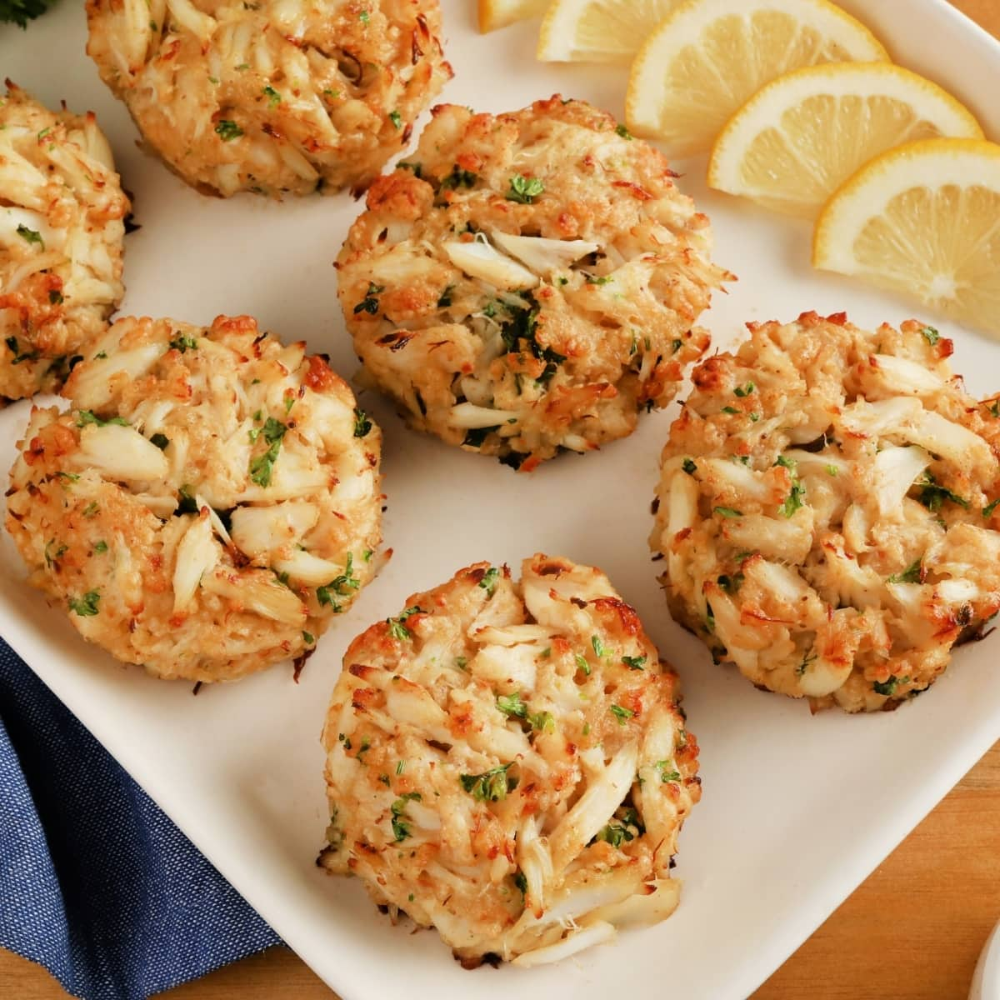 | 450 THB |        |
| Clam Chowder        | A hearty soup featuring fresh clams, potatoes, and a touch of bacon for flavor. | 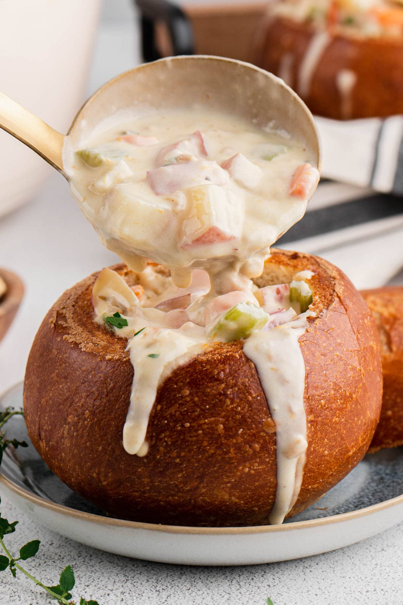 | 300 THB |        |
| Lobster Bisque      | A rich and creamy soup made from lobster stock, finished with cream and sherry. | 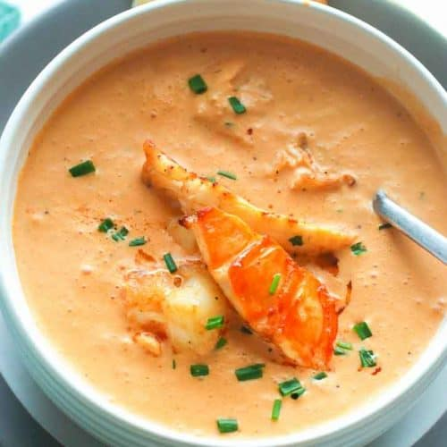 | 350 THB |        |
| Seafood Chowder     | A creamy soup made with a mix of seafood, including clams, shrimp, and potatoes. | 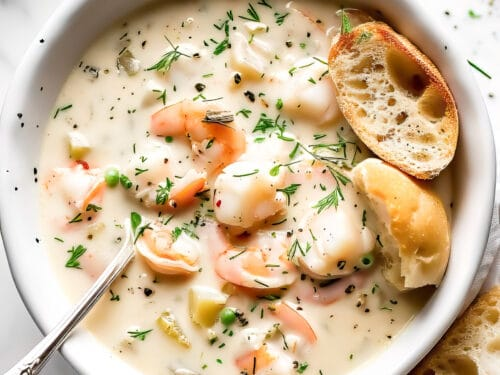 | 250 THB |        |
| Shrimp Scampi       | Succulent shrimp sautéed in garlic, butter, and white wine, served over pasta. |  | 400 THB |        |

## Thai Food

| Name         | Description                                                   |                                          |   Price |
|:-------------|:--------------------------------------------------------------|------------------------------------------|--------:|
| Fried Rice   | Rice fried with vegetables                                    | 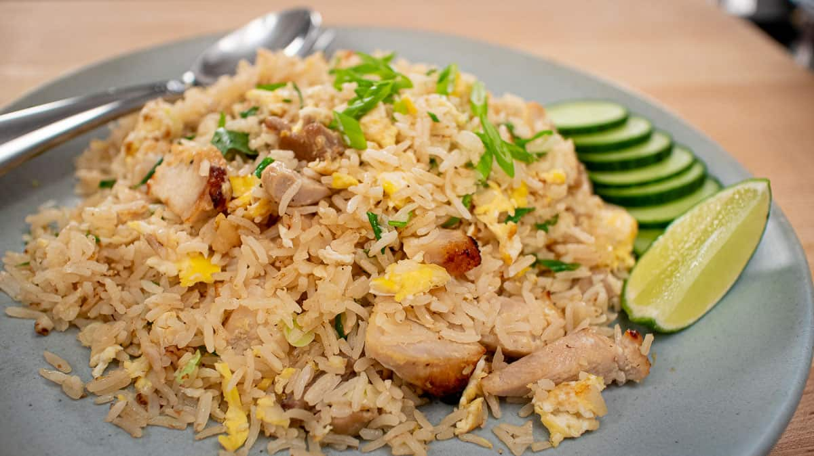     |  99 THB |
| Pad Thai     | Stir-fried noodles                                            | 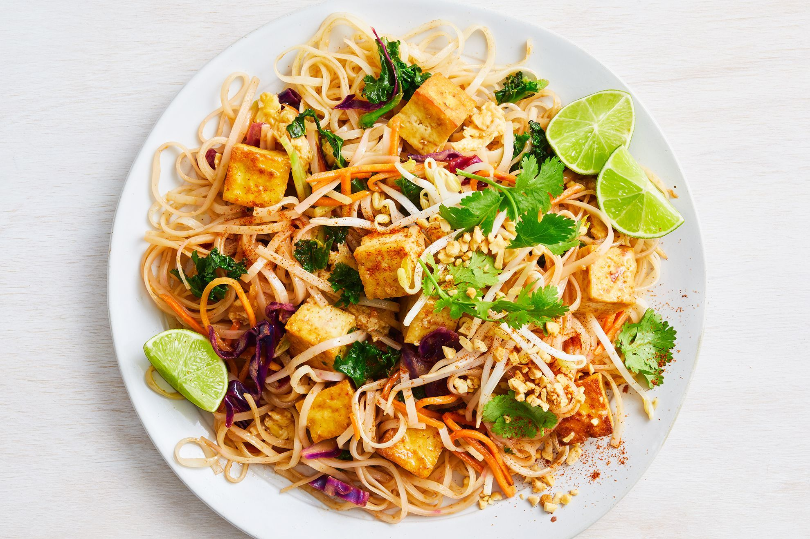         |  79 THB |
| Papaya Salad | Shredded green papaya with tomatoes, green beans, and peanuts | 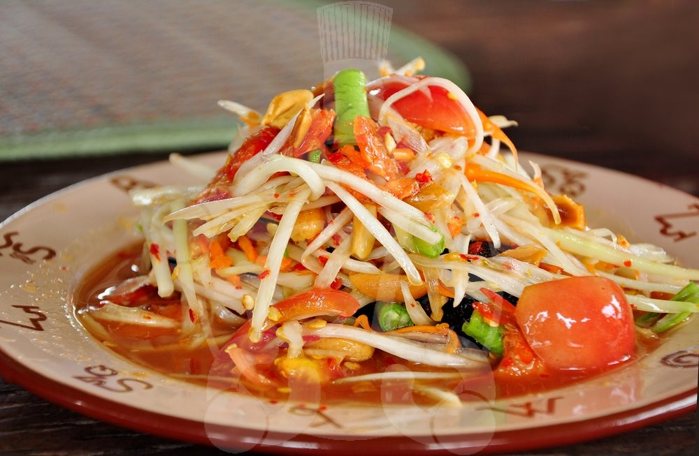 |  99 THB |
| Tom Yum      | Spicy and sour soup                                           | 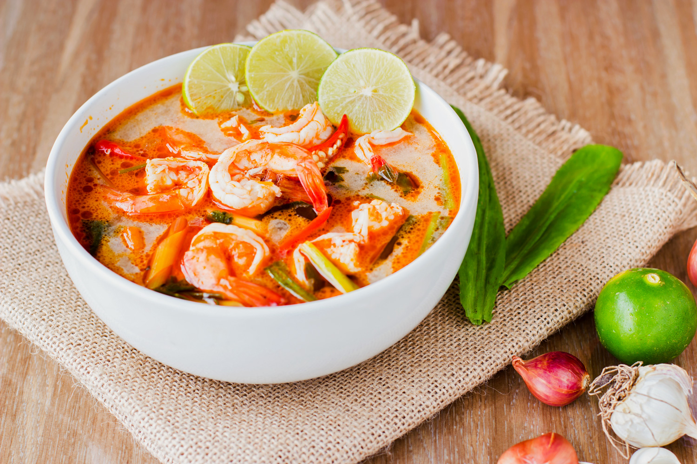           | 139 THB |
| Tom Kha      | Coconut soup with galangal, lemongrass                        | 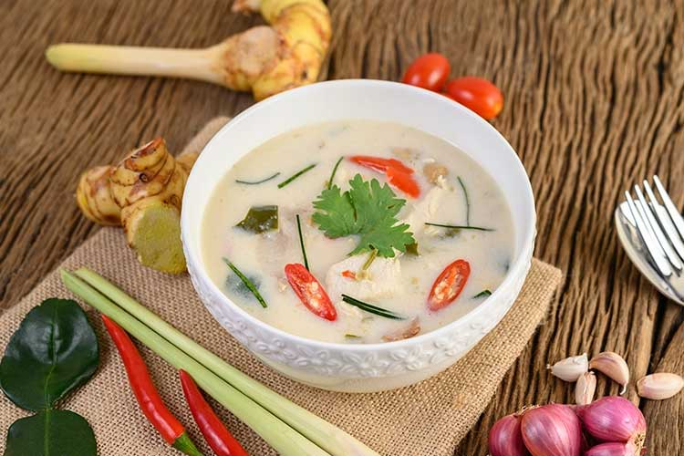           |  89 THB |

## Beverages

| Name        | Description                                   |                                |   Price |
|:------------|:----------------------------------------------|--------------------------------|--------:|
| Amazake     | Japanese beverage made from rice and rice koji|  |  40 THB  |
| Coke               | Coca-cola Brand | 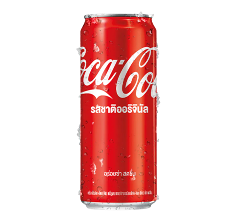 | 25 THB |        
| Thai Tea | Sweetened iced tea | 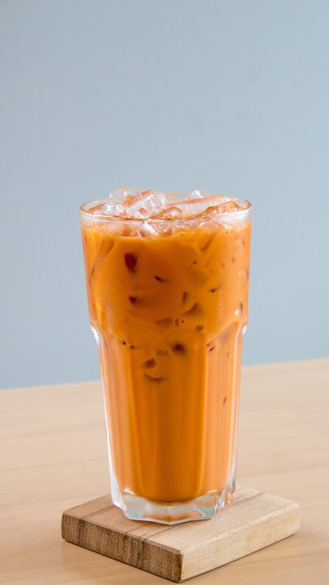 | 55 THB |

