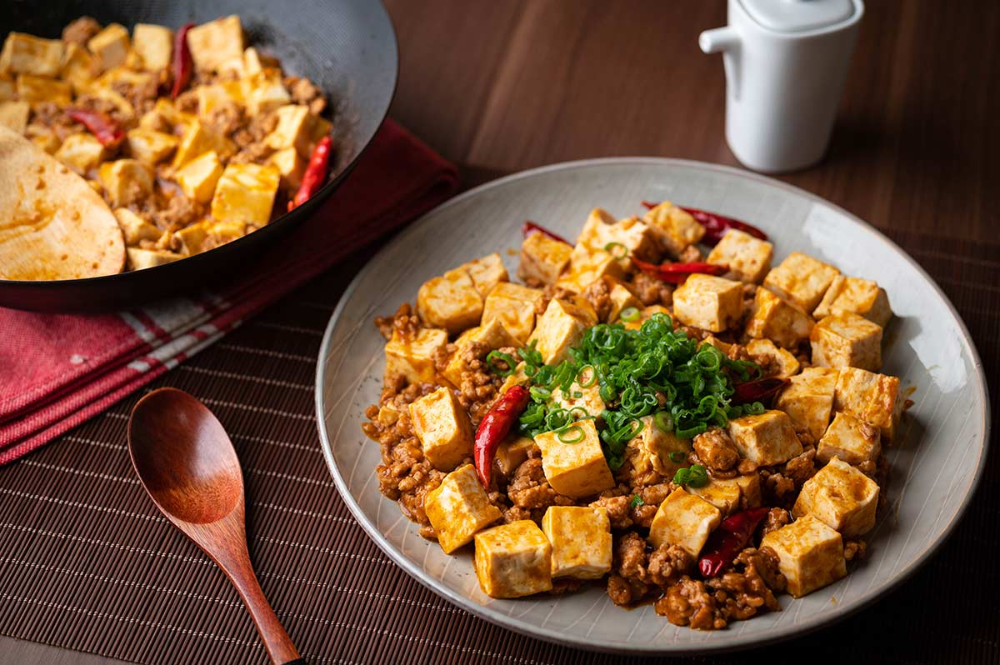
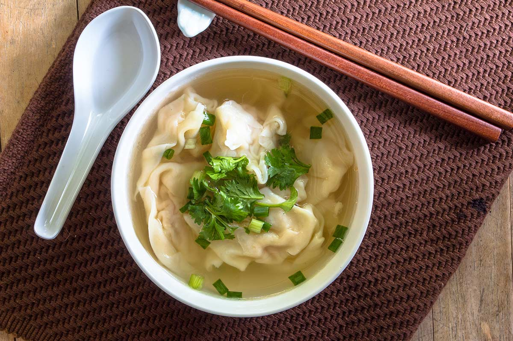
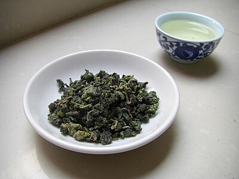

## Menu

[Chinese Food](#Chinese-Food) | ... | [Beverages](#beverages)

## Chinese Food

| Name               | Description                                          |                                                   | Price     |
|:-------------------|:-----------------------------------------------------|---------------------------------------------------|----------:|
| Mapo Tofu          | It comes to spicy and spice lovers alike             |                 |   100 THB |
| Peking Roast Duck  | A common delicacy enjoyed in Beijing                 | |   300 THB |
| Wonton Soup        | Are a type of dumpling draped in egg yolk wrappings  |             |    89 THB |
| Spring Rolls       | Spring rolls are the perfect side dish               |           |    59 THB |
| Chinese Hot Pot    | Also known as a steamboat                            |     |   599  THB|

## Beverages
| Name               | Description                                          |                                                   | Price     |
|:-------------------|:-----------------------------------------------------|---------------------------------------------------|----------:|
| Tieguanyin         | Tieguanyin falls between black and green tea         |               |   58 THB  |
