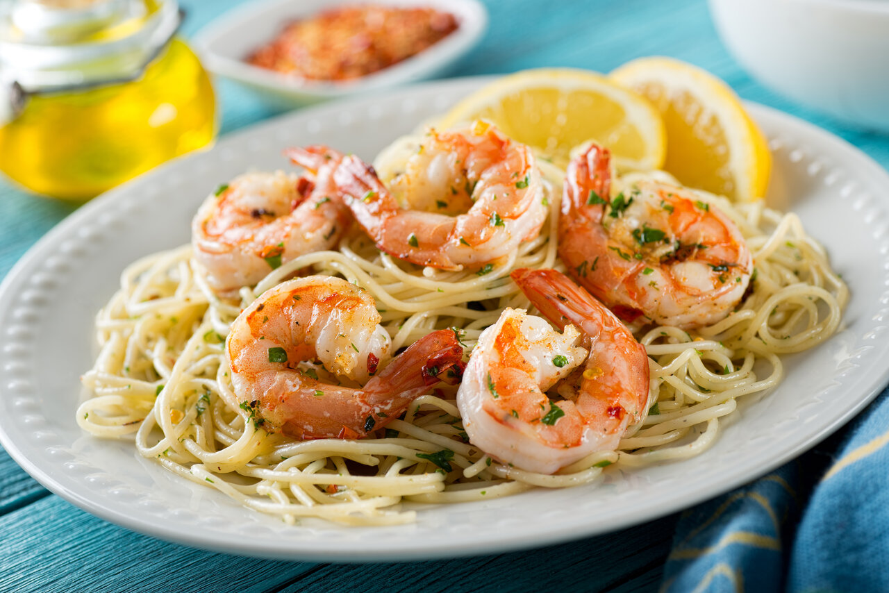

## Menu

[Seafood Menu](#seafood-menu) | ... | [Beverages](#beverages)

## Seafood Menu

| Name | Description                 |                        |   Price |
|:-----|:----------------------------|------------------------|--------:|
| Crab Cakes          | Delicious crab meat patties seasoned with herbs and spices, served with a tangy sauce. |  | 450 THB |        |
| Clam Chowder        | A hearty soup featuring fresh clams, potatoes, and a touch of bacon for flavor. |  | 300 THB |        |
| Lobster Bisque      | A rich and creamy soup made from lobster stock, finished with cream and sherry. |  | 350 THB |        |
| Seafood Chowder     | A creamy soup made with a mix of seafood, including clams, shrimp, and potatoes. |  | 250 THB |        |
| Shrimp Scampi       | Succulent shrimp sautéed in garlic, butter, and white wine, served over pasta. |  | 400 THB |        |

## Beverages

| Name | Description     |                             |  Price |
|:-----|:----------------|-----------------------------|-------:|
| Coke               | Coca-cola Brand |  | 25 THB |        |
